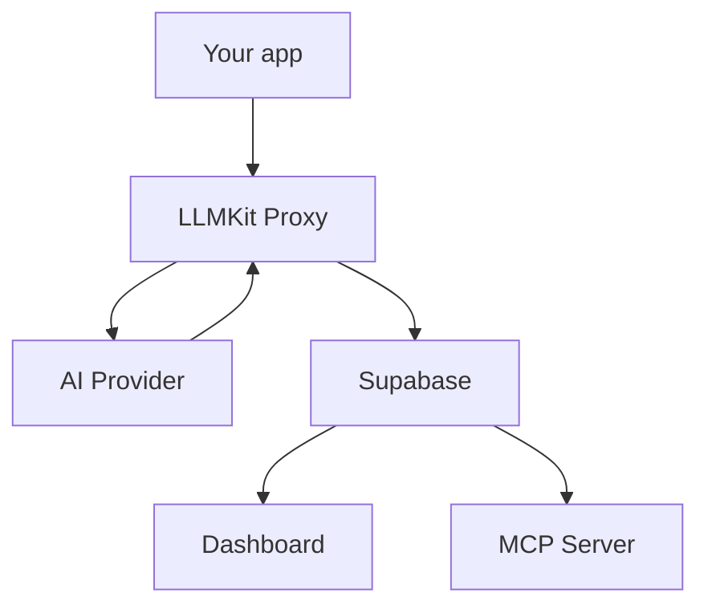

<p align="center">
  
</p>

<p align="center">
  Track what your AI agents spend.
</p>

[](https://github.com/smigolsmigol/llmkit/actions/workflows/ci.yml)
[](LICENSE)
[](https://pypi.org/project/llmkit-sdk/)
[](https://www.npmjs.com/package/@f3d1/llmkit-sdk)
[](https://github.com/smigolsmigol/llmkit/tree/main/packages/mcp-server)

<p align="center">
  <video src="https://github.com/user-attachments/assets/8ec33732-f651-4e35-9a27-5263c8a87ba7" width="680" autoplay loop muted playsinline>
    LLMKit CLI demo
  </video>
</p>

---

Open-source API gateway that sits between your app and AI providers. Every request gets logged with token counts and dollar costs. Budget limits reject requests when exceeded, not after.

## Why LLMKit

<p align="center">
  <video src="https://github.com/user-attachments/assets/d07dac81-8f18-4920-ae77-62872822d078" width="680" autoplay loop muted playsinline>
    LLMKit Dashboard
  </video>
</p>

Most cost tracking tools give you "soft limits" that agents blow past in the first hour. LLMKit runs cost estimation before every request. If it would exceed the budget, the request gets rejected before reaching the provider. Per-key or per-session scope.

Tag requests with a session ID or end-user ID to track costs per agent, per conversation, per user. The dashboard and MCP server surface this data in real time. Cost anomaly detection alerts when a single request costs 3x the recent median.

11 providers through one interface: Anthropic, OpenAI, Google Gemini, Groq, Together, Fireworks, DeepSeek, Mistral, xAI, Ollama, OpenRouter. Fallback chains with one header (`x-llmkit-fallback: anthropic,openai,gemini`).

Runs on Cloudflare Workers at the edge. Cache-aware pricing for Anthropic, DeepSeek, and Fireworks prompt caching. 700+ models priced across all providers. Open source, MIT licensed.

## How it works



Auth, budget check, route to provider (with fallback), log tokens and costs, update budget, fire alerts at 80%.

## Get started

1. **Create an account** at [llmkit-dashboard.vercel.app](https://llmkit-dashboard.vercel.app) (free while in beta)
2. **Create an API key** in the Keys tab
3. **Use it**: pick any method below

## CLI

Wrap any command. The CLI intercepts OpenAI and Anthropic API calls, forwards them through the proxy, and prints a cost summary when the process exits. No code changes.

```bash
npx @f3d1/llmkit-cli -- python my_agent.py
```

```
LLMKit Cost Summary
---
Total: $0.0215 (3 requests, 4.2s)

By model:
  claude-sonnet-4-20250514  1 req   $0.0156
  gpt-4o                    2 reqs  $0.0059
```

Works with Python, Ruby, Go, Rust, anything that calls the OpenAI or Anthropic API. Use `-v` for per-request costs as they happen, `--json` for machine-readable output.

## Python

```bash
pip install llmkit-sdk
```

Two ways to track costs:

**With the proxy** (budget enforcement, logging, dashboard):

```python
from openai import OpenAI

client = OpenAI(
    base_url="https://llmkit-proxy.smigolsmigol.workers.dev/v1",
    api_key="llmk_your_key_here",
)

response = client.chat.completions.create(
    model="gpt-4o",
    messages=[{"role": "user", "content": "hello"}],
)
```

**Without the proxy** (local cost estimation, zero setup):

```python
from llmkit import tracked
from openai import OpenAI

client = OpenAI(http_client=tracked())

response = client.chat.completions.create(
    model="gpt-4o",
    messages=[{"role": "user", "content": "hello"}],
)
# costs estimated locally from bundled pricing table
```

`tracked()` wraps your HTTP client and estimates costs from token usage. No proxy needed. Works with any SDK that accepts `http_client`. See the [SDK docs](https://pypi.org/project/llmkit-sdk/) for all options.

## TypeScript

```bash
npm install @f3d1/llmkit-sdk
```

```typescript
import { LLMKit } from '@f3d1/llmkit-sdk'

const kit = new LLMKit({ apiKey: process.env.LLMKIT_KEY })
const agent = kit.session()

const res = await agent.chat({
  provider: 'anthropic',
  model: 'claude-sonnet-4-20250514',
  messages: [{ role: 'user', content: 'summarize this document' }],
})

console.log(res.content)
console.log(res.cost)   // { inputCost: 0.003, outputCost: 0.015, totalCost: 0.018, currency: 'USD' }
```

Streaming, CostTracker (local cost tracking without the proxy), and Vercel AI SDK provider also available. See the [package README](packages/sdk) for details.

## MCP Server

<a href="https://glama.ai/mcp/servers/smigolsmigol/llmkit-mcp-server">
  
</a>

Query AI costs from Claude Code, Cline, or Cursor. Local tools auto-detect installed tools and work without an API key.

```json
{
  "mcpServers": {
    "llmkit": {
      "command": "npx",
      "args": ["@f3d1/llmkit-mcp-server"],
      "env": {
        "LLMKIT_API_KEY": "llmk_your_key_here"
      }
    }
  }
}
```

**11 tools** across 2 domains:

**Proxy** (need `LLMKIT_API_KEY`): `llmkit_usage_stats`, `llmkit_cost_query`, `llmkit_budget_status`, `llmkit_session_summary`, `llmkit_list_keys`, `llmkit_health`

**Local** (no key needed, works with Claude Code + Cline + Cursor): `llmkit_local_session`, `llmkit_local_projects`, `llmkit_local_cache`, `llmkit_local_forecast`, `llmkit_local_agents`

**Audit logging**: per-request logging with timestamps, model attribution, cost tracking, per-end-user attribution (`x-llmkit-user-id`), tool invocation logging, CSV export with sha256 integrity hash. This data can support record-keeping requirements but does not constitute regulatory compliance.

### SessionEnd Hook

Auto-log session costs when Claude Code exits. Add to your `settings.json`:

```json
{
  "hooks": {
    "SessionEnd": [{"hooks": [{"type": "command",
      "command": "npx @f3d1/llmkit-mcp-server --hook"}]}]
  }
}
```

Parses the session transcript and prints cost summary (tokens, spend, models used). No API key needed.

## Packages

| Package | Description |
|---------|-------------|
| [llmkit-sdk](https://pypi.org/project/llmkit-sdk/) (PyPI) | Python SDK: `tracked()` transport, cost estimation, streaming, sessions |
| [@f3d1/llmkit-sdk](packages/sdk) (npm) | TypeScript client, CostTracker, streaming |
| [@f3d1/llmkit-cli](packages/cli) | `npx @f3d1/llmkit-cli -- <cmd>`: zero-code cost tracking for any language |
| [@f3d1/llmkit-proxy](packages/proxy) | Hono-based CF Workers proxy: auth, budgets, routing, logging |
| [@f3d1/llmkit-ai-sdk-provider](packages/ai-sdk-provider) | Vercel AI SDK v6 custom provider |
| [@f3d1/llmkit-mcp-server](packages/mcp-server) | 11 tools: proxy analytics, local costs (Claude Code + Cline + Cursor) |
| [@f3d1/llmkit-shared](packages/shared) | Types, pricing table (11 providers, 700+ models), cost calculation |

## Testing

270+ tests across TypeScript and Python: cost calculation, budget enforcement, crypto, reservations, pricing accuracy, streaming, transport hooks, contract tests, and integration tests. CI runs on every push with a 6-stage security pipeline. See [SECURITY.md](SECURITY.md) for details.

## Self-host

```bash
git clone https://github.com/smigolsmigol/llmkit
cd llmkit && pnpm install && pnpm build

cd packages/proxy
echo 'DEV_MODE=true' > .dev.vars
pnpm dev
# proxy running at http://localhost:8787
```

Deploy to Cloudflare Workers:

```bash
npx wrangler login
npx wrangler secret put SUPABASE_URL
npx wrangler secret put SUPABASE_KEY
npx wrangler secret put ENCRYPTION_KEY
npx wrangler deploy
```

## Security

LLMKit handles your API keys. We take that seriously.

| Layer | What |
|-------|------|
| Encryption | Provider keys: AES-256-GCM, random IV, context-bound AAD |
| Hashing | User API keys: SHA-256, never stored in plaintext |
| Runtime | Cloudflare Workers: no filesystem, no .env, nothing to exfiltrate |
| Supply chain | All CI actions pinned to commit SHAs, explicit least-privilege permissions |
| Provenance | npm packages published with [Sigstore provenance](https://docs.npmjs.com/generating-provenance-statements) via GitHub Actions OIDC |
| Pre-commit | 19 secret patterns + credential file blocking + gitleaks (auto-installed via `pnpm install`) |
| CI pipeline | gitleaks, semgrep, pnpm audit, pip-audit, bandit, [KeyGuard](https://github.com/smigolsmigol/keyguard) |
| AI exclusion | .cursorignore + .claudeignore block AI tools from reading secrets |

Full details in [SECURITY.md](SECURITY.md).

## Contributing

See [CONTRIBUTING.md](CONTRIBUTING.md).

## Disclaimer

Cost estimates are based on publicly available pricing data and may not reflect the latest provider pricing. Do not use these estimates as the sole basis for billing. LLMKit is a logging and cost tracking tool, not a compliance product. Users are responsible for their own regulatory compliance.

## License

MIT. Built with [Claude Code](https://claude.ai/claude-code).
