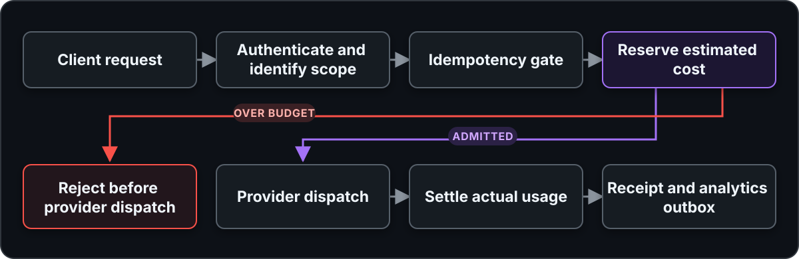

<p align="center">
  
</p>

<h3 align="center">Measure what your AI agents cost. Stop requests before they exceed a budget.</h3>

<p align="center">
  <a href="https://github.com/smigolsmigol/llmkit/actions/workflows/ci.yml"></a>
  <a href="https://pypi.org/project/llmkit-sdk/"></a>
  <a href="https://www.npmjs.com/package/@f3d1/llmkit-mcp-server"></a>
  <a href="https://scorecard.dev/viewer/?uri=github.com/smigolsmigol/llmkit"></a>
  <a href="https://www.bestpractices.dev/projects/12288"></a>
  <a href="LICENSE"></a>
</p>

<p align="center">
  <a href="https://llmkit.sh">Website</a> | <a href="https://llmkit.sh/docs">Docs</a> | <a href="https://api.llmkit.sh/v1/pricing/compare?mode=text-token&models=anthropic%2Fclaude-sonnet-4-6%2Copenai%2Fgpt-4o&input=1000&output=1000&cacheRead=0&cacheWrite=0">Pricing API</a> | <a href="SECURITY.md">Security</a>
</p>

LLMKit is an open-source AI gateway and SDK suite for cost attribution, budget admission, and
request evidence. The gateway reserves estimated spend before provider dispatch. It rejects
requests that cannot fit the active budget, then settles admitted reservations to actual usage when
the response completes.

The repository also ships local tracking surfaces that do not require an LLMKit account or proxy.

## Choose a surface

| Surface | Use it when | Package |
| --- | --- | --- |
| Python transport | You want local cost estimates around existing SDK calls | [`llmkit-sdk`](https://pypi.org/project/llmkit-sdk/) |
| CLI wrapper | Your OpenAI or Anthropic client honors its standard base-URL environment variable | [`@f3d1/llmkit-cli`](https://www.npmjs.com/package/@f3d1/llmkit-cli) |
| TypeScript SDK | You have an existing key and want sessions, streaming, and gateway access from TypeScript | [`@f3d1/llmkit-sdk`](packages/sdk) |
| MCP server | You want spend, budget, and local coding-session tools inside an MCP client | [`@f3d1/llmkit-mcp-server`](packages/mcp-server) |
| AI SDK provider | You use Vercel AI SDK 6 | [`@f3d1/llmkit-ai-sdk-provider`](packages/ai-sdk-provider) |
| Gateway and dashboard | You need shared budgets, provider routing, receipts, and analytics | [`packages/proxy`](packages/proxy), [`packages/dashboard`](packages/dashboard) |

## Quick start

### Local Python tracking

```bash
pip install llmkit-sdk
```

```python
from llmkit import tracked
from openai import OpenAI

costs = []
client = OpenAI(http_client=tracked(on_cost=costs.append))

client.chat.completions.create(
    model="gpt-4.1",
    messages=[{"role": "user", "content": "Summarize this incident."}],
)

print(f"${sum(item.total_cost or 0 for item in costs):.6f}")
```

The transport reads provider usage metadata and estimates cost from the bundled pricing catalog. It does not send tracking data to LLMKit.

### Zero-code CLI tracking

```bash
npx @f3d1/llmkit-cli -- python my_agent.py
```

Use `-v` for per-request output or `--json` for machine-readable results.

### Gateway mode (existing key)

Gateway examples require an existing LLMKit API key. Account creation and key management are
temporarily unavailable while the authenticated service is restored. If you do not already have a
key, use one of the local tracking paths above.

```python
from openai import OpenAI

client = OpenAI(
    base_url="https://api.llmkit.sh/v1",
    api_key="llmk_your_key_here",
)

response = client.chat.completions.create(
    model="gpt-4.1",
    messages=[{"role": "user", "content": "Draft a release note."}],
)
```

## The budget path

<p align="center">
  
</p>

The control path is built around three boundaries:

- **Atomic admission:** a Durable Object owns reservation state for each budget scope. Concurrent
  requests cannot spend the same remaining balance.
- **Dispatch-aware idempotency:** deterministic failures before dispatch release the key. After
  provider dispatch may have occurred, failures remain terminal to avoid duplicate spend.
- **Bounded responses:** non-streaming bodies and individual SSE frames have explicit byte limits.
  LLMKit cancels upstream reads when a limit is exceeded.

Request receipts bind the admission decision, provider attempt, settlement, and analytics handoff
with stable identifiers. Database writes use an outbox, so an analytics outage does not silently erase
budget evidence.

## MCP server

```json
{
  "mcpServers": {
    "llmkit": {
      "command": "npx",
      "args": ["-y", "@f3d1/llmkit-mcp-server"]
    }
  }
}
```

Five local tools inspect supported Claude Code sessions and Cline task data without an LLMKit key.
Six gateway tools query spend, budgets, keys, sessions, and service health when `LLMKIT_API_KEY`
contains an existing key. Together they expose 11 tools.

## Pricing data

The pinned catalog is a bundled reference snapshot, not a live quote. One source file,
[`packages/shared/pricing.json`](packages/shared/pricing.json), records the snapshot date and
generates the TypeScript, Python, and MCP tables. CI rejects drift between the source and generated
files. The public site renders only populated provider tables and displays the source date.

The public comparison endpoint requires no account:

```text
https://api.llmkit.sh/v1/pricing/compare?mode=text-token&models=anthropic%2Fclaude-sonnet-4-6%2Copenai%2Fgpt-4o&input=1000&output=1000&cacheRead=0&cacheWrite=0
```

The endpoint prices only the exact model keys supplied by the caller. It does not search for or
recommend the cheapest model. Pricing is an estimate, not a provider invoice. Provider billing rules,
model modality, and catalog freshness remain part of the error boundary.

## Evidence and current boundary

| Claim | Evidence in this repository | Boundary |
| --- | --- | --- |
| Concurrent budget admission is serialized | Worker fixtures exercise competing reservations, retries, settlement, and recovery | Deterministic local Worker and database proof |
| Retry behavior avoids duplicate dispatch | Idempotency tests cover payload mismatch, pre-dispatch release, and post-dispatch indeterminate state | Provider behavior is simulated in CI |
| Large provider responses are bounded | Success, error, and unterminated SSE fixtures verify rejection and stream cancellation | Bound is per buffered response or SSE frame |
| Pricing artifacts are reproducible | One generator and CI `--check` path cover all published language tables | Catalog values still require source updates |
| Hosted recovery can be evaluated safely | Guarded staging deploy and proof runners bind an isolated Worker, database, revision, and cleanup journal | A completed hosted concurrency and outage-recovery receipt is not claimed here |

See [`STAGING_PROOF.md`](STAGING_PROOF.md) for the isolated hosted proof contract. It deliberately refuses production targets and dirty worktrees.

## Development

```bash
git clone https://github.com/smigolsmigol/llmkit
cd llmkit
corepack pnpm@9.15.4 install --frozen-lockfile
corepack pnpm@9.15.4 build
corepack pnpm@9.15.4 quality:pr
```

Run the Worker locally with development-only bindings:

```bash
corepack pnpm@9.15.4 --filter @f3d1/llmkit-proxy dev
```

Generic deploy commands are intentionally omitted. Staging and production use separate guarded scripts with explicit target confirmation.

## Security

Provider credentials are encrypted with AES-256-GCM using a random IV and owner/provider-bound
additional authenticated data. LLMKit API keys are hashed before storage. CI includes secret
scanning, static analysis, dependency review, CodeQL, and package provenance checks.

Read the [security policy and architecture](SECURITY.md) and the machine-readable
[Security Insights snapshot](security-insights.yml). Please report vulnerabilities through
[GitHub private vulnerability reporting](https://github.com/smigolsmigol/llmkit/security/advisories/new)
or email `security@llmkit.sh`.

## License

[MIT](LICENSE)
